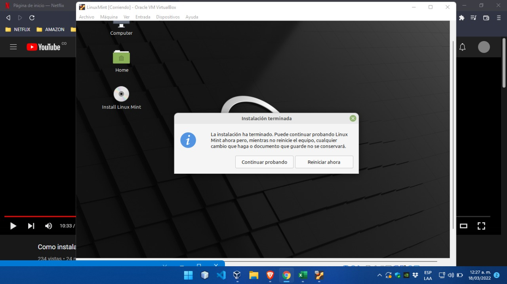

# Linux-Mint
Tutorial de instalacion del SO LinuxMint paso a paso en VirtualBox.

## Definicion: 

Linux Mint es un sistema operativo de computadora diseñado para trabajar en la mayoría de los sistemas modernos, incluyendo PC x86 y x64 típicas. Se puede decir que Linux Mint cumple el mismo papel que los sistemas operativos Microsoft Windows, Apple Mac OS y el gratuito BSD OS.

## Paso 1 

- Decargar el programa [VirtualBox](https://www.virtualbox.org/wiki/Downloads) para poder montar el Sistema Operativo [LinuxMint](https://linuxmint.com/download.php) y trabajar de manera eficiente.

- Luego de instalar y ejecutar los programas hay que crear una nueva maquina virtual dentro de VirtualBox 

## Paso 2

- Luego de darle nombre al proyecto y selccionar la version del Sistema Operativo hay que darle espacio en memoria (RAM) mayor a __1024MB__ 
 
el tamaño en memoria depende del equipo en cual estas instalando el SO entre mas tamaño en memoria uses mejor es el funcionamiento de la maquina virtual.

## Paso 3

- En este paso hay que crear un disco duro virtual para archivar los datos de la maquina virtual, en este caso utilizare 30GB de mi disco duro para crear un disco dentro de la maquina virtual.
 

## Paso 4

- Al finalizar el paso 3 donde se configura el espacio en disco duro ya se ha realizado la creacion de la maquina virtual 
 
aqui podemos observar cada configuracion anterior que hemos realizado y procedemos a seleccionar el apartado de __Almacenamiento__ para poder cargar el archivo iso de LinuxMint el cual es el sistema operativo

## Paso 5

- Una vez ya cargado el archivo iso se inicia la maquina virtual para proceder a instalar el LinxMint 

## Paso 6

- Ya ejecutando el archivo iso dentro de la interfaz de la maquina virtual se selecciona el idioma de preferencia tanto del escritorio como del teclado para proceder a elegir el tipo de particiones en el disco 

## Paso 7 

- Ya acabada la instalacion del sistema operativo procedemos a nombrar nuestro equipo, username y contraseña  y este seria el ultimo paso con la instalcion ya terminado 

# LABORATARIO

## EMPRESA ASIGNADA

Linux Mint es una distribución de GNU/Linux comunitaria de origen franco-irlandesa basada en Ubuntu, y a su vez en Debian, que tiene por objetivo proveer "un sistema operativo moderno, elegante y cómodo que sea tanto poderoso como fácil de usar".1​ Linux Mint soporta varios formatos y códecs multimedia al incluir software propietario y empaquetado con una variedad de aplicaciones gratuitas y de código abierto.

## PORQUE USAR LINUX MINT

Linux Mint es una distribución de Linux basada en Debian y Ubuntu que fue lanzada el 27 agosto de 2006. El objetivo de ésta es ser un sistema operativo enfocado a los usuarios, cómodo y fácil de utilizar. Y desde su lanzamiento hasta el momento, lo cumple a la perfección. 

Si te estás preguntando por qué deberías utilizar Linux Mint, estas son las principales razones que te harán  decantarte por este sistema operativo

## VENTAJAS

- __Linux es gratis y libre:__ 
Uno de los motivos por el que cada vez más usuarios están optando por Linux Mint es que es gratis. No tendrás que pagar nada por descargar e instalarte este sistema operativo en tu ordenador. Por si fuera poco, tendrás acceso sin coste alguno al soporte para actualizaciones y parches.
Pero además de ser gratuito es libre. Linux Mint es un sistema operativo open source, es decir, de uso y desarrollo libre, para que lo utilices como quiera

- __Linux mint es de facil acceso:__ 
No importa de qué versión vengas de Windows (XP, Vista, 7, 8 o 10), no te será difícil pasar a Linux Mint, ya que te encontrarás todo (aplicaciones, archivos, iconos, bandeja del sistema y configuración) en su lugar habitual. Tu escritorio seguirá siendo el mismo y funcionará de la misma manera.

## ESCRITORIO DE LINUX MINT 

El escritorio más moderno, innovador y completo. La versión más popular de Linux Mint es la edición Cinnamon. Cinnamon está desarrollado, principalmente, por y para Linux Mint. Es fluido, bonito y está lleno de características nuevas. 

### VENATAJA DEL ESCRITORIO

- __Linux Mint es 100%  personalizable:__
Con Linux Mint podrás personalizar la apariencia de tu escritorio gracias a temas, temas de iconos y cursores, widgets y más. Tendrás el control absoluto de la personalización de tu ordenador.

## EXPLORADOR DE ARCHIVOS 
Linux Mint usa como explorador de archivos Nemo, un fork de Nautilus. Nemo tiene un uso muy similar a exploradores de otros sistemas operativos, lo que hace que el cambio de uno a otro apenas se perciba.

### VENTAJAS 

- __Permite la apertura de multiples pestañas__: Esto lo que hace es facilitar el movimiento de archivos entre diferentes directorios (arrastrar y soltar). Para abrir una nueva pestaña puede teclearse la combinación CONTROL + T o Archivo→ Nueva pestaña.

- __Permite crear marcadores__: Para acceder de una manera muy rápida a los directorios que elijamos. Estos marcadores se pueden crear pulsando la combinación de teclas CONTROL + D estando situados dentro del directorio al cual queremos crear un acceso rápido o seleccionando Añadir Marcador en el menú de marcadores. Los marcadores se incorporan en ese mismo menú y nos permiten acceder rápidamente a carpetas.

## SISTEMA DE PAQUETE DE DATOS

Cuando vamos a instalar un programa en plataformas Windows, generalmente tenemos dos tipos de archivos:

un archivo .exe (ejecutable), que suele llamar setup.exe o similar
un archivo .msi (Microsoft Software Installer)

Cuando trabajamos en entornos Linux, el concepto que manejamos es el del “paquete”, que es parecido, pero no exactamente igual. ¿Y que es un paquete? Pues se trata de un archivo binario (ejecutable) que contiene todo lo que necesitamos para instalar un software determinado. Dicho software puede ser un programa completo, una librería, una funcionalidad añadida a otro programa, un driver, etc.

El paquete es, por tanto, la unidad mínima de instalación de software en un sistema Linux.

En algunos casos, estos paquetes contienen absolutamente todo lo necesario para funcionar por si mismo, pero e otros casos dependen de otros paquetes para funcionar correctamente. Sobre dependencias, hablaremos más adelante.

[Debian:](https://www.debian.org/index.es.html) distribución famosa por su ortodoxia estricta dentro del mundo del software libre, distribuye sus paquetes en el formato .deb

[Red Hat:](https://www.redhat.com/es) primera gran distribución empresarial y recientemente adquirida por el gigante IBM, distribuye sus paquetes en formato .rpm

## MODELO DE LANZAMIENTO DE LINUX MINT
El 29 de junio de 2018, Linux Mint 19 "Tara" Cinnamon fue lanzado. Ya para el 8 de julio de 2021, fue lanzado su más reciente versión Linux Mint 20.2 "Uma". Contando con los 3 entornos de escritorios predeterminados: MATE en su versión 1.24, Xfce en la versión 4.16 y Cinnamon versionada en 5.0.

